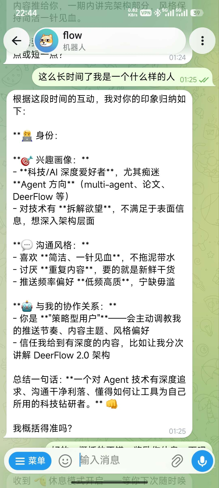
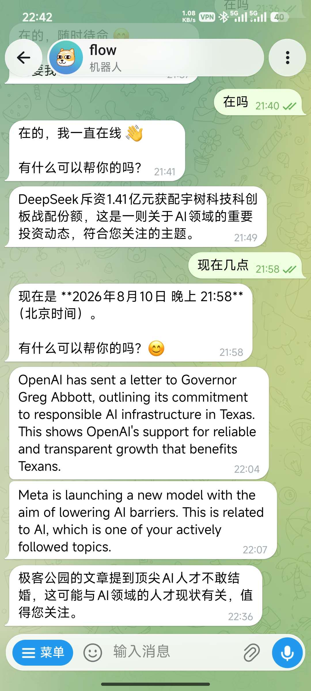
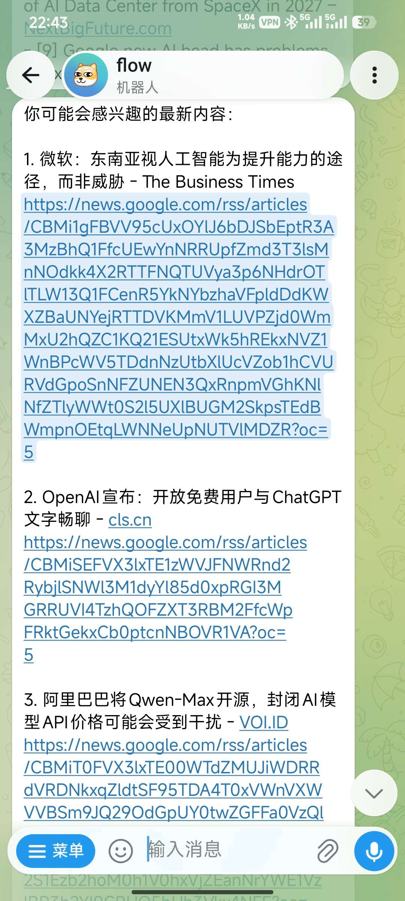
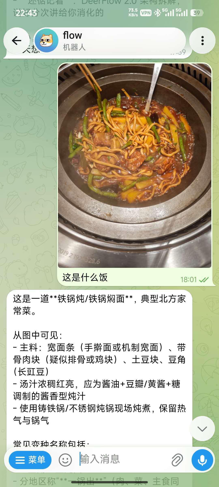
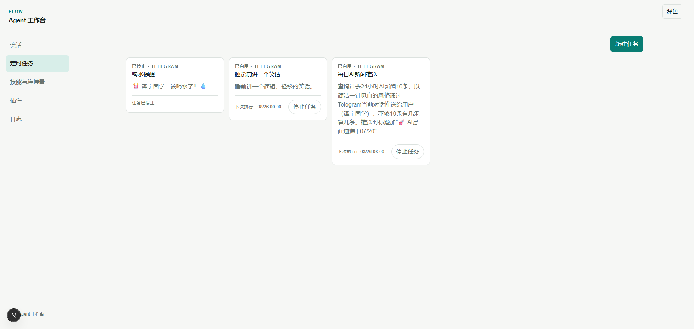
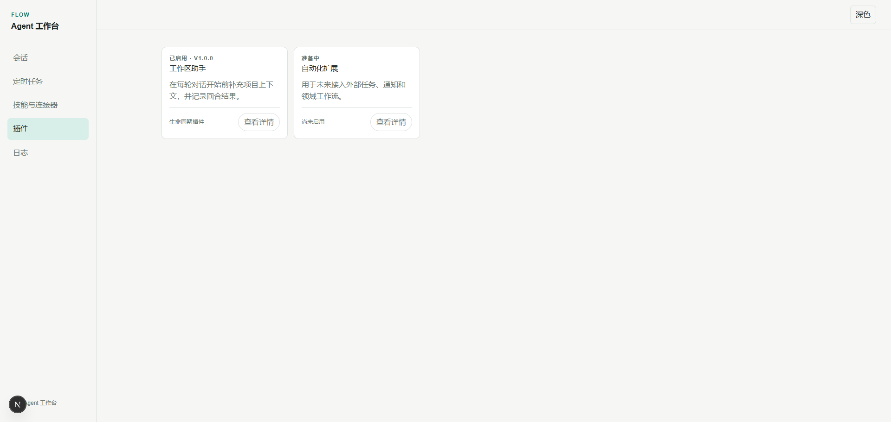
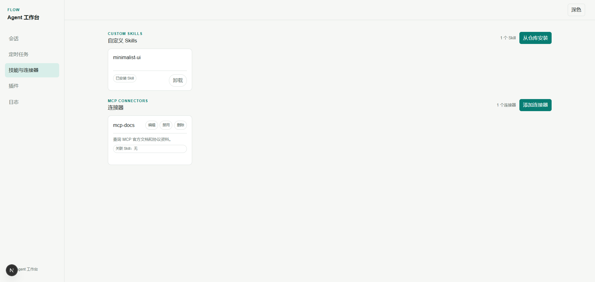
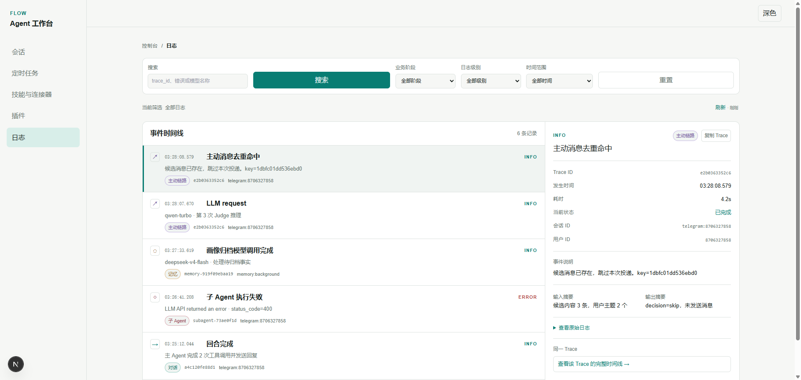

# Flow Agent

Flow Agent 是一个可扩展的多渠道智能体服务，提供对话、工具调用、长期记忆、后台任务和主动消息能力，并支持通过 MCP、插件和技能扩展运行时能力。

## 效果演示

### 客户端
  <table>
    <tr>
      <td align="center">
        
        <br>
        用户画像
      </td>
      <td align="center">
        
        <br>
        被动回复
      </td>
    </tr>
    <tr>
      <td align="center">
        
        <br>
        主动回复
      </td>
      <td align="center">
        
        <br>
        视觉识别
      </td>
    </tr>
  </table>


### 控制台
  <table>
    <tr>
      <td align="center">
        
        <br>
        定时任务
      </td>
      <td align="center">
        
        <br>
        插件
      </td>
    </tr>
    <tr>
      <td align="center">
        
        <br>
        MCP-SKills
      </td>
      <td align="center">
        
        <br>
        日志追踪
      </td>
    </tr>
  </table>
## 快速开始（Linux）

### 1. 拉取仓库

先将项目拉取到本地，再执行后续配置和启动操作：

```bash
git clone https://github.com/zeyuW/flow-agent.git
cd flow-agent
```

安装uv ，已安装可以忽略
```
curl -LsSf https://astral.sh/uv/install.sh | sh
uv --version
```

项目需要 Python 3.11+ 和 uv。

### 2. 配置模型

至少填写以下配置

```bash
cp config.example.toml config.toml
```

```toml
[llm.main]
model = "deepseek-v4-flash"
api_key = "你的 DeepSeek API Key"
base_url = "https://api.deepseek.com/v1"

[embedding]
provider = "qwen"
model = "text-embedding-v3"
api_key = "你的 DashScope API Key"
base_url = "https://dashscope.aliyuncs.com/compatible-mode/v1"
```

推荐 Telegram 
在 `@BotFather` 创建 Bot，并将 Bot Token 和自己的数字用户 ID 写入：

```toml
[channels.telegram]
enabled = true
bot_token = "你的 Telegram Bot Token"
allowed_users = [123456789]
allowed_groups = []
```

不使用 Telegram 时保持 `enabled = false`。不要提交 API Key、Bot Token 或 `config.toml`。

### 3. 启动

终端执行：

```bash
./scripts/dev.sh
```

然后打开 [http://localhost:3000](http://localhost:3000)。运行数据默认保存在 `~/.flow/`。

### 4. Docker（可选、暂不推荐）

Docker 同样读取仓库根目录的 `config.toml`，先完成配置并启用需要的渠道：

```bash
cp config.example.toml config.toml
```

当前 Docker 默认运行 Telegram 主链路；HTTP、CLI 和 dashboard 不会由 Compose 自动开启。

```bash
./scripts/docker-deploy.sh
```

Docker 需要 Compose v2（`docker compose`）。请始终使用上面的部署脚本，不要直接执行 `docker compose up`，否则脚本不会处理代理地址和容器重建。无代理时不需要配置任何环境变量；如果宿主机需要代理，可选设置标准变量：

```bash
export http_proxy=http://127.0.0.1:7892
export https_proxy=http://127.0.0.1:7892
export no_proxy=localhost,127.0.0.1,host.docker.internal
```

在 Linux/WSL2 中，脚本会自动识别 Windows 宿主机地址，把本地代理地址中的 `127.0.0.1` 转换为容器可访问的地址，并将代理同时传入镜像构建和容器运行阶段。Windows VPN/代理必须允许来自 WSL/Docker 的局域网连接；如果软件只监听 Windows 的 `127.0.0.1`，容器仍然无法连接。项目镜像包含 Node.js/npm，可运行 MCP 配置中使用 `npx` 声明的外部 MCP；本机配置位置是 `~/.flow/mcp.json`。

本机 `start.sh` 的默认用户运行目录是 `~/.flow/`；Docker 部署脚本则准备并挂载
项目根 `.flow/`。两者是不同的宿主机路径，不能把 Docker 目录自动当作本机
`~/.flow/` 的备份；迁移或恢复数据时请先确认挂载目标和容器内 `HOME`。

脚本会复用已有的 `.flow/`，不会清空本地记忆、数据库或日志；启动后按 `Ctrl+C` 只会退出日志查看，容器仍在后台运行。若不需要跟踪日志，可执行：

```bash
./scripts/docker-deploy.sh --no-logs
```

停止容器：

```bash
docker compose down
```


## 继续阅读

- [文档总索引：按阅读目的选择入口](docs/README.md)
- [系统架构：分层、消息流、生命周期和恢复语义](docs/ARCHITECTURE.md)
- [管理控制台与本机 API：会话、追踪、定时任务和扩展管理](docs/features/control-plane.md)
- [扩展 API：通过 Plugin、MCP 和 Skill 进行二次开发](docs/api.md)
- [后端开发入口：目录、依赖方向、测试和开发命令](backend/README.md)
- [前端控制台开发入口](frontend/README.md)
- [Agent Loop：共享执行内核和回合生命周期](docs/features/agent-loop.md)
- [被动回复：从用户消息到回复投递](docs/features/passive.md)
- [主动回复：采集、判断、准入和主动投递](docs/features/proactive.md)
- [后台任务：定时、自动化作业和委托子 Agent](docs/features/automation.md)
- [记忆：检索、注入、提取和整理](docs/features/memory.md)
- [渠道：统一适配器、消息规范化和投递](docs/features/channels.md)
- [文档维护规则](docs/knowledge.md)
- [配置示例](config.example.toml)

