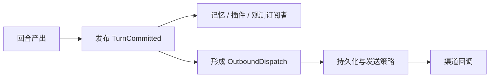

# Flow Agent 架构说明

## 1. 架构目标

Flow Agent 将“接收消息、组织智能体回合、调用模型和工具、保存状态、向外发送结果”拆分为边界明确的运行单元。设计重点不是某一种渠道或模型 SDK，而是以下约束：

- 同会话顺序、跨会话并行，避免上下文相互干扰。
- 回合提交、记忆整理、观察事件与出站投递职责分离。
- 主动行为、定时任务、后台任务与用户对话复用受控的运行时边界。
- 渠道、工具、插件和 MCP 服务可扩展，但不反向侵入核心流程。
- 可持久化的状态与明确的失败语义，避免重启后盲目重放。

本文件描述逻辑组件和数据流，不是部署拓扑或目录索引。配置决定哪些组件在某次运行中被实例化；具体能力的阅读入口见文末功能文档导航。

## 2. 总体方块图（分层视图）

主交互按楼层自上而下流动：外部输入先进入接入与触发层，再由回合编排层组织，随后使用智能体能力层完成推理和工具执行。回复或主动消息沿出站路径向上返回渠道。扩展层与基础设施层为上层提供能力和状态支撑，不承担用户请求的主编排职责。

```text
+====================================================================+
| 第 1 层：外部交互层                                                 |
| 用户 / 外部系统                                                    |
+====================================================================+
                              | 请求、回复
                              v
+====================================================================+
| 第 2 层：接入与触发层                                               |
| 渠道适配器（HTTP / Telegram / CLI / QQ）                           |
| MessageBus · 主动循环 · 定时 / 后台 / 子代理运行时                 |
+====================================================================+
                              | 统一入站消息 / 触发任务
                              v
+====================================================================+
| 第 3 层：回合编排层                                                 |
| AgentLoop（会话串行、跨会话并行）                                  |
| 被动回合管线（七阶段）· EventBus · OutboundPort                    |
+====================================================================+
                              | 上下文组装、推理、工具调用
                              v
+====================================================================+
| 第 4 层：智能体能力层                                               |
| 提示词与上下文 · Agent / LLM 路由 · 工具注册表与守卫 · 记忆引擎    |
+====================================================================+
                              | 已注册工具 / 外部能力请求
                              v
+====================================================================+
| 第 5 层：扩展与外部能力层                                           |
| 插件与技能 · MCP 注册表与连接池 · 主动数据源                       |
+====================================================================+

  主链返回：第 4 层产出 -> 第 3 层提交回合 -> 第 2 层出站分发
            -> 第 1 层渠道回复。

+====================================================================+
| 第 6 层：基础设施与运行保障层（横向支撑第 2 至第 5 层）             |
| 配置 · 工作区与进程锁 · SQLite（会话 / 任务 / 记忆 / Outbox）      |
| 认证 · 权限 · 策略 · 日志 · 追踪 · 运行状态                        |
+====================================================================+
```

### 分层交互说明

- **第 1 层与第 2 层**：渠道把平台协议转换为统一入站消息并发布到 `MessageBus`；出站消息由总线分发回相应渠道。用户只接触这一层。
- **第 2 层与第 3 层**：`AgentLoop` 从消息总线取出入站消息，按会话顺序启动回合管线。主动、定时、后台和子代理运行时也通过受控入口触发消息或任务，而不是直接绕过回合编排。
- **第 3 层与第 4 层**：回合管线负责阶段顺序、异常边界和提交时机；它调用提示词、模型、工具和记忆能力，但不理解具体渠道协议或外部服务细节。
- **第 4 层与第 5 层**：工具注册表通过 MCP 使用外部能力；插件与技能为管线和工具提供可注册扩展；主动数据源为主动运行时提供判断依据。扩展必须通过公开接口参与，不能直接修改回合私有状态。
- **第 6 层**：配置、工作区锁、持久化、安全和可观测性横向支撑上层。它们提供状态与保障，不决定用户请求的业务顺序。

主路径是“自上而下处理、沿出站路径向上返回”；`EventBus` 是第 3 层向记忆、插件和观测等订阅者广播状态的旁路，不替代 `MessageBus` 的工作消息传递。

## 3. 接入与会话边界

渠道适配器是系统唯一应该理解外部协议的区域。它完成身份或平台层校验后，把输入转换为统一消息，并将输出转换为平台发送操作。核心运行时不应导入或依赖具体渠道 SDK。渠道边界的完整说明见[渠道文档](features/channels.md)。

入站消息至少关联渠道、会话和聊天对象。AgentLoop 使用会话标识维护处理所有权：会话空闲时立即启动一个回合；会话处理中抵达的新消息进入该会话的待处理队列；当前回合结束后按 FIFO 启动下一条。不同会话的回合采用独立异步任务执行。

这是一种“每会话串行、会话之间并行”的模型。它保证了同一聊天记录的因果顺序，但不保证不同会话之间的全局顺序，也不能把一个会话的并行吞吐误解为无限制并发。

## 4. 双总线与提交顺序

### 4.1 MessageBus：工作消息与投递

MessageBus 承载需要被某个处理者消费的工作项：渠道发布入站消息，AgentLoop 消费入站消息；管线通过出站端口提交出站分发请求，渠道订阅并发送属于自己的出站消息。出站端口抽象使管线不用知道消息最终由哪个渠道 SDK 投递。

出站可接入 SQLite outbox。写入 outbox、尝试发送、得到渠道确认以及可能的重试均有独立状态。对于结果未知的发送，系统不应因为“未收到确认”就自动再次发送；这是防止重复消息的安全优先策略。

### 4.2 EventBus：生命周期扇出

EventBus 用于不要求返回值的状态通知。例如回合开始、流式增量、工具开始/完成和回合提交。订阅者可包括记忆整理、运行状态面板、插件或追踪记录器。事件订阅可以撤销，避免长期运行进程中重复注册处理器。

### 4.3 为什么先提交事件、后投递回复

回合的 `AfterTurn` 阶段先广播 `TurnCommitted`，随后才发起出站投递。这样，记忆和观测系统能够以同一份已提交回合数据为依据工作；回复发送失败时不会把一个没有内部提交记录的输出暴露给用户。该顺序并不等于所有订阅者都必须同步完成，也不构成用户侧最终送达保证。



## 5. 被动回合管线

被动回复的读者向说明见 [Agent Loop 文档](features/agent-loop.md) 和 [被动回复文档](features/passive.md)。本节只保留它在整体架构中的边界和提交顺序。

一次被动回合以统一的 `TurnFlow` 承载输入、会话、渠道、追踪标识、工具轨迹和最终输出。它依次执行以下阶段：

| 阶段 | 目的 | 主要产物或约束 |
| --- | --- | --- |
| 回合开始 | 通知扩展模块并建立追踪上下文 | 会话与 `trace_id` 进入流程 |
| 前置处理 | 执行进入回合前的策略或扩展逻辑 | 可影响后续流程 |
| 推理前处理 | 为模型调用准备状态 | 不承担协议发送 |
| 提示词渲染 | 汇合人设、记忆、历史、工具和系统信息 | 受提示词预算约束 |
| 推理 | 调用模型并按上限处理工具调用 | 工具经注册表与守卫执行 |
| 推理后处理 | 整理模型和工具结果 | 生成最终输出前的处理点 |
| 回合提交 | 记录、发布事件、创建出站投递 | 事件先于出站路径 |

阶段模块采取快照方式加入单个回合：当前运行中的回合不应因插件在中途装卸而改变其已选扩展集合。管线捕获异常并记录追踪事件，同时尝试通过标准出站路径反馈失败信息。

## 6. 智能体、模型、工具与记忆

Agent 回合的完整心智模型见 [Agent Loop 文档](features/agent-loop.md)，记忆读写闭环见 [记忆文档](features/memory.md)。

Agent 是模型调用边界，LLM 路由器可区分主模型和快速模型。提示词组装器根据预算组合不同来源内容；人设解析器则为主动/被动场景提供一致但可区分的表达约束。

工具注册表提供可被模型声明与调用的工具集合。工具守卫负责在调用前限制可访问工具；插件和 MCP 可向注册表贡献能力，但它们必须经过同样的选择和守卫路径。工具调用以事件形式发布，使渠道或观察模块能够呈现进度。

### 6.1 Subagent 委派

主 Agent 通过 `task` 工具委派边界清晰的子任务。运行时为 Subagent 创建隔离上下文和受限工具集，由 `SubagentExecutor` 执行并返回结构化结果；主 Agent 收到结果后继续推理并生成最终回复。Subagent 默认不能递归调用 `task`，每次委派受最大轮数、超时、并发数和单次运行总量限制。

```text
Lead Agent → task 工具 → SubagentExecutor → SubagentResult → Lead Agent 汇总
```

`task` 的同步结果路径与后台任务通知路径分离：前者服务于当前回合的推理，后者通过 MessageBus 在长任务完成后重新进入会话。

记忆由人类可读文件和向量存储共同组成。检索在提示词渲染阶段为回答提供上下文；回合提交后，记忆订阅者基于提交事件做抽取、去重、替换检测与归档。读路径与写路径分离，降低长期整理影响交互延迟的概率。

## 7. 主动、定时和后台执行

主动线路的详细准入和恢复语义见 [主动回复文档](features/proactive.md)；定时任务、自动化作业和委托子 Agent 的区别见 [后台任务文档](features/automation.md)。

主动运行时通过事件桥或独立循环在指定会话上检查机会。它先进行频率、冷却、每日上限和会话忙碌判断；通过后才从数据网关获取告警、内容与上下文。判断循环给出发送或跳过的结论，解析器再核验来源和策略，最后复用出站端口投递。

当没有告警和内容、数据源没有报错并且满足最小间隔时，可以进入 Drift 空闲任务管线。Drift 与主动推送共享准入边界，而不是一个绕过频率策略的后台通道。

定时服务将到期提醒和 Agent 任务保存为可恢复记录。直接提醒进入出站路径；Agent 任务被转换为带调度元数据的入站消息，从而复用被动回合、会话隔离、工具策略和审计路径。后台作业与子代理同样应通过明确的运行时接口接入，而不直接抢占用户回合状态。

## 8. 扩展层与装配层

应用装配层负责创建配置、模型客户端、总线、记忆、任务服务、插件管理器、MCP 注册表和运行时单元，并在启动/关闭时按依赖顺序管理生命周期。它是组合根，不应积累具体渠道协议或领域决策。

插件可以提供阶段模块、工具钩子、事件订阅者、后台作业、主动源和 MCP 声明；Skill 提供可复用的方法、知识和资源。MCP 注册表负责合并内置、项目配置和插件来源的服务定义，并拒绝重名服务。连接外部 MCP 失败应保持基础服务可启动，但失败服务不应暴露为可调用工具。三条扩展路径的接入契约见[扩展 API](api.md)。

## 9. 状态、恢复与运行安全

运行时状态包括会话、记忆向量、定时任务、后台作业、主动策略与 outbox。它们以不同目的持久化，不能把任何单个数据库当作完整的事务边界。尤其是外部渠道调用可能在本地超时后实际成功，因此 outbox 采用对“未知结果不重放”的保守语义。

工作区进程锁用于防止同一工作区被多个服务实例同时运行。配置、认证、权限和工具守卫共同形成安全边界；其中任何一项缺失都不应由模型提示词“补救”。日志、追踪和运行单元快照提供诊断依据，`session_id` 与 `trace_id` 是关联跨组件行为的主要键。

## 10. 阅读指引

- 想先理解一次 Agent 回合如何运行：阅读 [Agent Loop 文档](features/agent-loop.md)。
- 想了解用户消息如何得到回复：阅读 [被动回复文档](features/passive.md)。
- 想了解系统如何主动触达：阅读 [主动回复文档](features/proactive.md)。
- 想了解定时、自动化和委托后台执行：阅读 [后台任务文档](features/automation.md)。
- 想了解记忆如何产生和注入：阅读 [记忆文档](features/memory.md)。
- 想了解平台如何接入和投递：阅读 [渠道文档](features/channels.md)。
- 想进行二次开发或接入自定义能力：阅读 [扩展 API](api.md)。
- 开发过程中的设计决策、需求与任务记录：保存在 `docs/specs/`，不属于本对外架构说明的替代内容。
